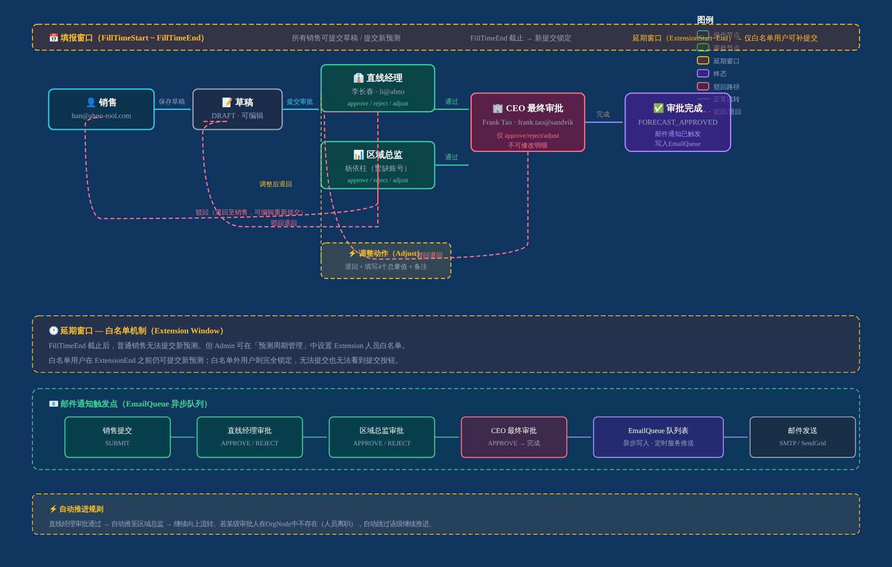
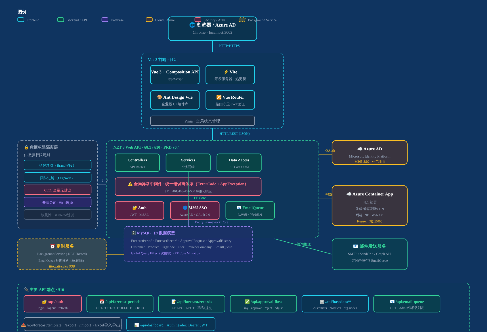

# Sandvik Forecast Tool — 产品需求文档 (PRD)

**版本：** v0.6
**日期：** 2026-05-07
**状态：** 🟡 编写中

---

## 1. 项目概述

### 1.1 项目背景

山特维克中国事业部（Sandvik China Division）需要一个销售预测管理系统，用于收集、管理和审批各区域销售团队的预测数据，支持自下而上的预测提交流程，以及自上而下的审批管理。

### 1.2 项目目标

- 实现销售预测的在线填报、审批和汇总
- 支持多层级组织架构（销售 → 直线经理 → 大区负责人 → CEO）
- 按区域/产品线/客户维度进行数据隔离和权限控制
- 为管理层提供可视化的预测分析和决策支持

### 1.3 系统边界

- **上线范围：** 销售预测填报、审批流程、Dashboard 汇总、基础数据管理和系统管理
- **暂不在范围内：** ERP系统对接，HR系统对接

---

## 2. 业务流程



### 2.1 销售预测周期

- **预测周期：** FC（Forecast Cycle），如 2026FC1、2026FC2
- **每个 FC 的月份数量不固定**（3个月/6个月/9个月/跨年），由**预测起始/结束年月**控制
- **填报窗口**由**填报起始/截止时间**控制；截止后未提交的新预测不能再提交，已在审批流程中的数据不受影响
- **当前周期确定规则：** 同一时间点只有一个周期在有效填报期内（FillTimeStart ≤ now ≤ FillTimeEnd 或 Extension窗口）。公司层面强制周期时间不重叠，系统按当前时间自动取落在窗口内的周期，**无需 IsActive 字段**
- **时间校验：** 统一使用**服务器时间**（UTC），前端展示时显示服务器时间并标注时区
- **填报数据不做自动保存**，依赖模板上传/下载

### 2.2 审批状态机

空白 → 草稿（已保存）→ 提交至直线经理审批 → 提交至区域总监审批 → 提交至总经理审批 → 审批已完成。

- 草稿提交后原记录状态直接变更，**不新建记录**
- 直线经理审批后推进到上一层；区域总监审批后推进到 CEO；CEO 最终审批后流程结束
- 审批任一节点可驳回（附评语），数据退回上一层由原填报人修改后重新提交
- 审批任一节点可"调整"（驳回+附4个汇总指导值），供下级参考

---

## 3. 功能模块

> 本章节以功能为中心，描述每个功能模块的业务逻辑、字段规则和关联关系。
> 详细 UI 布局、按钮、交互状态、空态、分页规格见 **§5 功能细化规格**。

### 3.1 Dashboard（数据看板）

**路由：** `/`（首页）

**职责：** 展示预测汇总数据，永远显示最新有效数据。

**功能逻辑：**
- 按权限展示当前周期（或最近有数据的周期）的汇总卡片、月度趋势图、区域/产品线分布图
- **数据口径：仅含已审批通过数据**（草稿+审批中数据不计入任何汇总）
- 当前周期判断：系统按服务器时间自动取落在 FillTimeStart~FillTimeEnd 窗口内的周期
- 无有效周期时：显示最近一个有数据的周期，周期选择器可切换
- Dashboard **永远有数据**，不能空着

**角色可见范围：**

| 角色 | 可见数据范围 |
| --- | --- |
| CEO / SYS_ADMIN | 全量 |
| 区域总监（VP_SALES） | 本大区所有销售 |
| 直线经理（MANAGER） | 本团队（自己+所管辖销售） |
| 销售（SALES） | 仅自己 |

**汇总卡片计算口径：**

| 卡片 | 计算口径 |
| --- | --- |
| 本周期总预测金额 | sum(order_amount)，仅已审批通过 |
| 已填报客户数 | distinct count(customer_id)，含审批中 |
| 待我审批数 | 当前用户是审批人的审批请求数（status != 已完成） |
| 本周期已完成审批 | status = 已完成 的记录数 |

详见 §5 F-01。

---

### 3.2 销售预测管理

> 包含预测周期管理（Admin）、预测填报（销售）、预测审批（审批人）三个子模块。
> 业务逻辑集中在此章节，UI 规格见 §5 F-02~F-04。

#### 3.2.1 预测周期管理（Admin）

**路由：** `/admin/forecast-periods`

**职责：** 管理员配置预测周期（FC），定义填报窗口、延期窗口和预测月份范围。

**7+1个字段：**

| 字段 | 说明 |
| --- | --- |
| 周期名称 | 如"2026 FC1"，不能与已有名称重复 |
| 填报起始时间 | 服务器时间，不能晚于截止时间 |
| 填报截止时间（FillTimeEnd） | 只阻止新提交，不影响已在审批流程中的数据。**FillTimeEnd 过期后锁定，不可修改。** |
| 预测起始年月 | 控制填报表头的月份范围起点（如2026-07） |
| 预测结束年月 | 控制填报表头的月份范围终点（如2027-03） |
| 延期起始时间（ExtensionStart） | 延迟提交的窗口开始，**可等于 FillTimeEnd 之后的任意时间点** |
| 延期截止时间（ExtensionEnd） | 延迟提交的窗口结束，**Extension 窗口可独立设定** |
| 延期人员名单 | 可多选，按名称搜索筛选勾选，允许哪些销售在延期窗口内补提交 |

**周期修改规则：**
- Admin 可修改任意字段（名称、时间、延期窗口等）
- **底线：已有填报数据的周期禁止删除**（字段可改，删除是禁区）
- FillTimeEnd 过期后锁定；Extension 窗口可随时调整（即使已过期也可继续延）

详见 §5 F-02。

#### 3.2.2 预测填报（销售）

**路由：** `/forecast`（列表）、`/forecast/form`（新建）、`/forecast/form/:id`（编辑/查看）

**职责：** 销售填报和提交预测数据。

**填报流程：**
1. 销售在填报有效期内，按"客户+产品+月份"填写订单/开票数量和金额
2. 提交后进入审批流，**不可自行撤回**
3. 支持单个添加、批量月份添加、模板下载/上传、导出

**自动填入字段（来自 OrgNode，只读）：**

| 字段 | 来源 |
| --- | --- |
| 业绩归属区域 | OrgNode，自动填入 |
| 销售大区 | OrgNode，自动填入 |

**手动选择字段：**

| 字段 | 规则 |
| --- | --- |
| 客户 | 下拉选择，**受品牌过滤**（Customer.Brand = Salesperson.Brand） |
| 产品线 | 5级联动（PA→SubPA-1→SubPA-2→SubPA-3→SubPA-4），SubPA-4 支持模糊搜索 |
| 开票公司 | **自由选择，无品牌/区域限制** |

**关键校验：**
- 订单数量/开票数量：整数，可为0，**不可为负**
- 订单金额/开票金额：整数（精确到元），可为0，**不可为负**
- 开票金额与订单金额**无关联**，各自分别独立，无上限/比例限制
- 月度数据与年度汇总**无校验关系**
- 单价由系统自动计算（订单金额÷订单数量）

**数据状态：** 草稿 / 审批中 / 已通过 / 已驳回

**批量上传：** 相同（销售+周期+客户+产品+月份）覆盖更新

**复制上期：** 可从历史周期复制同客户+同产品的数据，复制后为草稿状态，需手动提交

详见 §5 F-03。

#### 3.2.3 预测审批（审批人）

**路由：** `/approval`（列表）、`/approval/:id`（详情）

**职责：** 审批人对下级提交的预测进行审批。

**三个审批动作：**

| 动作 | 行为 |
| --- | --- |
| 通过 | 自动推进到上一层审批节点；若已是最高节点则流程结束（status=已完成） |
| 驳回 | 附评语，数据退回到上一层；原填报人可编辑后重新提交 |
| 调整 | 驳回+附4个汇总指导值（调整订单总金额/开票总金额/订单总数量/开票总数量），供下级参考 |

**审批链节点权限：**

| 审批节点 | 可修改数据 | 可执行操作 |
| --- | --- | --- |
| 直线经理 | ✅ 可修改 | 通过/驳回/调整 |
| 区域总监 | ✅ 可修改 | 通过/驳回/调整 |
| 总经理/Frank Tao | ❌ 不可修改 | 仅通过/驳回（后端强制控制） |

**审批历史：** 记录操作人、时间、动作类型、调整值和评语。

**邮件通知：** 由队列异步发送，不阻塞主流程。提交时预渲染模板内容存入队列表，邮件服务实时轮询推送。

详见 §5 F-04。

---

### 3.3 基础数据管理

#### 3.3.1 客户管理

**路由：** `/admin/customers`

**职责：** 管理员维护客户主数据。

**字段：**

| 字段 | 必填 | 校验 |
| --- | --- | --- |
| 客户名称 | ✅ | 不能重名 |
| 品牌 | ✅ | 下拉选择 |
| 联系人 | ❌ | |
| 联系电话 | ❌ | |
| 状态 | ✅ | 启用/停用 |

**品牌过滤逻辑（数据安全关键）：**
- 每个客户归属一个品牌（`customers.brand`）
- 每个销售也归属一个品牌（`users.brand`）
- 销售只能填报自己品牌下的客户（`Salesperson.Brand = Customer.Brand`）
- **品牌过滤在后端查询层强制执行，不可绕过**
- 列表支持品牌过滤和关键词模糊搜索（左右模糊，可按俗称搜到规范名称）

详见 §5 F-05。

#### 3.3.2 产品管理

**路由：** `/admin/products`

**职责：** 管理员维护产品层级主数据。

**产品层级：** PA → SubPA-1 → SubPA-2 → SubPA-3 → SubPA-4，共5级

**5级联动行为规则：**

| 选择变化 | PA变 | SubPA-1变 | SubPA-2变 | SubPA-3变 | SubPA-4变 |
| --- | --- | --- | --- | --- | --- |
| 选PA后 | — | ✅清空重选 | ✅清空重选 | ✅清空重选 | ✅清空重选 |
| 选SubPA-1后 | — | — | ❌保持不变 | ❌保持不变 | ❌保持不变 |
| 选SubPA-2后 | — | — | — | ✅清空重选 | ✅清空重选 |
| 选SubPA-3后 | — | — | — | — | ✅清空重选 |
| 选SubPA-4后 | — | — | — | — | — |

**SubPA-4 特殊处理：**
- 型号数量大，采用**输入框+模糊搜索下拉**
- 用户输入 → 下拉列表实时显示匹配项（左右模糊）
- 支持按俗称搜索（如输入"Tungsten"匹配"钨钢刀片"）
- 选择后填入输入框；SubPA-4 由系统自动分配3位流水号

**8大产品线：**

| 编号 | 名称 |
| --- | --- |
| 1 | AH INSERT |
| 2 | Kelite |
| 3 | ROUND |
| 4 | Regrinding |
| 5 | PCD |
| 6 | Coating |
| 7 | Medical |
| 8 | Multiple |

详见 §5 F-06。

#### 3.3.3 组织架构管理

**路由：** `/admin/org`

**职责：** 管理员维护组织架构树（OrgNode）。

**树形展示：4层固定层级**

```
山特维克中国事业部
└── Frank Tao（CEO / 最终审批人）
    ├── 杨依柱（大区负责人）
    │   └── 李长春（直线经理）
    │       ├── 韩学健、李清、李思梦（销售）
    │       └── 孙迎春、武健、赵强强、郑鸿鹏（销售）
    └── 其他大区（大区负责人）
        └── （直线经理 → 销售，同级结构）
```

**区域划分（已知）：**
- 北部销售大区（下属：北京区域等）
- 其他大区（待确认）

**OrgNode 节点字段：**

| 字段 | 说明 |
| --- | --- |
| 姓名 | |
| 角色 | CEO / VP_SALES / MANAGER / SALES |
| 上级 | parent_id（自引用） |
| 品牌 | 销售归属的品牌 |
| 所属公司 | |
| 业绩归属区域 | 销售填报时自动填入，只读 |
| 销售大区 | 销售填报时自动填入，只读 |
| 状态 | 在职/离职 |

**业务属性说明：** 组织架构树中每个节点可关联"品牌""销售大区""业绩归属区域"等业务属性，销售填报时自动带出，无需手动选择。

详见 §5 F-07。

---

### 3.4 系统管理

#### 3.4.1 用户账号管理

**路由：** `/admin/users`

**职责：** 管理员维护用户账号。

**字段：**

| 字段 | 必填 | 说明 |
| --- | --- | --- |
| 姓名 | ✅ | |
| 邮箱 | ✅ | M365账号，登录唯一标识 |
| 角色 | ✅ | 下拉选择：SYS_ADMIN / CEO / VP_SALES / MANAGER / SALES |
| 关联OrgNode | ✅ | 下拉选择 |
| 品牌 | ❌ | 仅销售角色时必填 |
| 状态 | ✅ | 启用/停用 |

**重要提示：** 首次SSO登录前，用户**必须先在系统中建好账号**；人员离职时管理员停用账号。

详见 §5 F-08。

#### 3.4.2 审批流程配置

**职责：** 管理员配置各审批节点的邮件通知规则和消息模板。

**配置内容：** 每个审批节点单独配置是否触发邮件 + 使用哪个模板。

**消息模板占位变量：**

| 变量 | 说明 |
| --- | --- |
| `{PeriodName}` | 周期名称 |
| `{SubmitterName}` | 提交人姓名 |
| `{ActionType}` | 动作类型（提交/通过/驳回/调整） |
| `{AdjustOrderAmount}` | 调整订单总金额（调整时有值） |
| `{AdjustInvoiceAmount}` | 调整开票总金额 |
| `{AdjustOrderQty}` | 调整订单总数量 |
| `{AdjustInvoiceQty}` | 调整开票总数量 |
| `{Comments}` | 评语 |
| `{OperatedAt}` | 操作时间 |

**邮件触发时机：** 审批动作发生时（提交/通过/驳回/调整）；触发后立即预渲染内容存入队列表，邮件服务实时轮询推送，不阻塞主流程。

详见 §5 F-09。

#### 3.4.3 开票公司管理

**路由：** `/admin/invoice-companies`（开票公司列表）、`/admin/user-invoice-permissions`（用户-开票公司权限配置）

**职责：** 管理员维护开票公司及跨部门用户的数据可见性配置。

**开票公司字段：** 公司名称、税号、状态（启用/停用）

**用户-开票公司权限（多对多）：** 配置财务等不在审批体系中的部门用户，可查看哪些开票公司的数据。

**填报时规则：** 销售填报时开票公司**无品牌/区域限制**，自由选择。

详见 §5 F-10。

#### 3.4.4 操作日志

**路由：** `/admin/audit-logs`

**职责：** 记录所有用户操作日志，供管理员审计。

**记录范围：** 登录、增、删、改、查操作；按操作类型/用户/时间筛选。

**查看权限：** 仅 SYS_ADMIN。

---

## 4. 数据权限规则

### 4.1 权限矩阵

| 角色 | 自己数据 | 团队数据 | 本大区数据 | 全量数据 |
| --- | --- | --- | --- | --- |
| 销售（SALES） | ✅ 读写 | ❌ | ❌ | ❌ |
| 直线经理（MANAGER） | ✅ 读写 | ✅ 读写 | ❌ | ❌ |
| 大区负责人（VP_SALES） | ✅ 读写 | ✅ 读写 | ✅ 读写 | ❌ |
| CEO | ✅ 读写 | ✅ 读写 | ✅ 读写 | ✅ 读写 |
| 系统管理员（SYS_ADMIN） | ✅ 读写 | ✅ 读写 | ✅ 读写 | ✅ 读写 |

### 4.2 两类权限体系

**A. 审批链权限（基于 OrgNode 层级）**

| 角色 | 可看到的数据范围 |
| --- | --- |
| 销售（SALES） | 仅自己填报的数据 |
| 直线经理（MANAGER） | 自己 + 所管辖所有销售的数据 |
| 区域总监（VP_SALES） | 自己 + 手下所有销售的数据（递归向上） |
| CEO（Frank Tao） | 全量数据 |

**B. 跨部门特别权限（基于开票公司配置）**

适用于财务等不在审批体系中的部门人员。

一张 `user_invoice_company_permissions` 表：

| 字段 | 说明 |
| --- | --- |
| id | 主键 |
| user_id | 用户ID |
| invoice_company_id | 开票公司ID（一对多） |

配置后，该用户可看到所分配开票公司下的全部预测数据。

### 4.3 数据过滤逻辑优先级

1. 如果用户在"跨部门特别权限表"中有配置 → 按开票公司权限过滤
2. 如果用户是审批链中的角色 → 按 OrgNode 层级递归过滤
3. SYS_ADMIN → 全量

### 4.4 品牌过滤

山工多品牌，每个销售只归属一个品牌，每个客户也只归属一个品牌。过滤逻辑：`Salesperson.Brand = Customer.Brand`，确保销售只能填报自己品牌下的客户。**品牌过滤在后端查询层强制执行，不可绕过。**

### 4.5 数据只读规则

- 销售提交后进入审批流，提交人不可编辑
- 当前审批节点操作人（直线经理→区域经理→最终审批人）可修改数据后再提交
- 只有被退回后，退回节点的人才可编辑
- 最终审批人（Frank Tao）只审批不修改，有问题直接退回

---

## 5. 功能细化规格

> 本章节定义每个功能模块的 UI 布局、操作按钮、字段定义、空态和分页规格。
> 业务逻辑（字段规则、权限体系、联动关系）见 §3 对应章节。

### F-01 Dashboard（数据看板）

#### F-01.1 页面布局

```
┌─────────────────────────────────────────────────────────────┐
│ 顶部导航栏                                                    │
├─────────────────────────────────────────────────────────────┤
│ 周期选择器： [2026 FC1 ▼]  ← 仅SYS_ADMIN显示多周期切换      │
├──────────────┬──────────────┬──────────────┬────────────┤
│ 汇总卡片1     │ 汇总卡片2     │ 汇总卡片3     │ 汇总卡片4   │
│ 本周期总金额   │ 已填报客户数   │ 待审批数      │ 已完成审批数 │
│ ¥12,345,678  │ 45家         │ 12条         │ 33条       │
└──────────────┴──────────────┴──────────────┴────────────┘
┌─────────────────────────────────────────────────────────────┐
│ 图表Tab切换：[订单金额] [开票金额]                           │
├─────────────────────────────────────────────────────────────┤
│ 月度趋势折线图（12个月）                                     │
└─────────────────────────────────────────────────────────────┘
┌─────────────────────────────────────────────────────────────┐
│ 区域/产品线分布                                              │
├───────────────────────────┬─────────────────────────────────┤
│ 按区域汇总（柱状图）       │ 按产品线汇总（饼图）             │
└───────────────────────────┴─────────────────────────────────┘
```

#### F-01.2 图表交互

- **Tab切换：** 订单金额/开票金额，切换后折线图+柱状图同步更新
- **悬停提示：** 显示该月具体金额，格式 ¥999,999,999
- **点击柱状/折线点：** 不跳转，查看明细入口在列表页

---

### F-02 预测周期管理（Admin）

#### F-02.1 周期列表页

**路由：** `/admin/forecast-periods`

**页面布局：**

```
┌─────────────────────────────────────────────────────────────┐
│ [新增周期] 按钮（右上角）                                     │
├─────────────────────────────────────────────────────────────┤
│ 列表（表格）                                                 │
│ 周期名称 | 填报窗口 | 延期窗口 | 状态 | 操作                  │
└─────────────────────────────────────────────────────────────┘
```

**表格列定义：**

| 列 | 宽度 | 排序 | 说明 |
| --- | --- | --- | --- |
| 周期名称 | 150px | 默认升序 | 如"2026 FC1" |
| 填报窗口 | 200px | 否 | FillTimeStart ~ FillTimeEnd |
| 延期窗口 | 200px | 否 | ExtensionStart ~ ExtensionEnd，无则显示"-" |
| 状态 | 100px | 否 | 即将开始/填报中/已截止/已结束 |
| 操作 | 150px | 否 | [编辑] [删除*] |

\*删除仅当该周期无任何填报数据时显示

**按钮逻辑：**
- [新增周期] → 弹窗表单
- [编辑] → 弹窗表单，数据预填充
- [删除] → 弹出确认框，「该周期无填报数据，确认删除？」

#### F-02.2 周期表单（新建/编辑）

**字段：**

| 字段 | 类型 | 必填 | 校验/说明 |
| --- | --- | --- | --- |
| 周期名称 | text | ✅ | 如"2026 FC1"，不能与已有名称重复 |
| 填报起始时间 | datetime | ✅ | 服务器时间，不能晚于截止时间 |
| 填报截止时间 | datetime | ✅ | 不能早于起始时间 |
| 预测起始年月 | month | ✅ | 如2026-07，控制填报页面月份范围起点 |
| 预测结束年月 | month | ✅ | 不能早于起始年月 |
| 延期起始时间 | datetime | ❌ | 默认=FillTimeEnd+1天 |
| 延期截止时间 | datetime | ❌ | 不能早于延期起始时间 |
| 延期人员名单 | multi-select user | ❌ | 选择哪些销售可在延期窗口内补提交 |

**底部按钮：** [取消] [保存]
**保存后行为：** 关闭弹窗，列表刷新，toast提示"保存成功"

---

### F-03 预测填报

#### F-03.1 填报列表页

**路由：** `/forecast`

**进入逻辑：**
1. 进入时实时查 OrgNode，取当前用户的周期+客户+业绩归属区域
2. 初始显示**空白列表**（展示已填报条目数量+金额汇总）
3. 无数据时：全空白，显示"暂无填报数据"

**页面布局：**

```
┌─────────────────────────────────────────────────────────────┐
│ 周期选择器：[2026 FC1 ▼]  ← 系统自动取当前有效周期          │
├─────────────────────────────────────────────────────────────┤
│ 顶部汇总：本周期已填报 ¥12,345,678 / 45条记录               │
├─────────────────────────────────────────────────────────────┤
│ 筛选栏：[客户 ▼] [产品线 ▼] [状态 ▼] [重置]              │
├─────────────────────────────────────────────────────────────┤
│ 操作按钮区：[填报] [模板下载] [模板上传] [导出]            │
├─────────────────────────────────────────────────────────────┤
│ 数据表格（列表）                                            │
└─────────────────────────────────────────────────────────────┘
```

**筛选栏规则：**
- **客户：** 下拉列表，仅显示品牌匹配的客户（`Customer.Brand = Salesperson.Brand`）
- **产品线：** 5级联动选择器（PA→Sub PA-4）
- **状态：** 全部 / 草稿 / 审批中 / 已通过 / 已驳回
- **重置：** 清空所有筛选条件

**表格列定义：**

| 列 | 宽度 | 排序 | 说明 |
| --- | --- | --- | --- |
| 序号 | 50px | 否 | 自然序号 |
| 客户名称 | 180px | ✅升序 | |
| 产品 | 200px | ✅升序 | 显示L1+L2+L3名称 |
| 销售大区 | 100px | 否 | 自动带出，不可改 |
| 订单金额 | 130px | ✅降序 | 格式¥999,999，红色≤0 |
| 开票金额 | 130px | ✅降序 | 格式¥999,999，红色≤0 |
| 状态 | 90px | 否 | 颜色标签（见下） |
| 最后操作时间 | 140px | ✅降序 | YYYY-MM-DD HH:mm |
| 操作 | 180px | 否 | 操作按钮组（见下） |

**状态颜色标签：**

| 状态 | 颜色 | 说明 |
| --- | --- | --- |
| 草稿 | 灰色 | draft |
| 审批中 | 蓝色 | pending |
| 已通过 | 绿色 | approved |
| 已驳回 | 红色 | rejected |

**操作按钮组（按状态显示）：**

| 按钮 | 草稿 | 审批中 | 已通过 | 已驳回 |
| --- | --- | --- | --- | --- |
| 查看 | ✅ | ✅ | ✅ | ✅ |
| 编辑 | ✅ | ❌ | ❌ | ✅（驳回后可编辑） |
| 删除 | ✅ | ❌ | ❌ | ❌ |
| 提交 | ✅ | ❌ | ❌ | ❌ |
| 撤回 | ❌ | ✅ | ❌ | ❌ |

**提交按钮逻辑：** 点击 → 弹出确认框「提交后将进入审批流程，是否确认？」

**撤回按钮逻辑：** 点击 → 弹出确认框「撤回后数据将退回草稿，是否确认？」

**删除按钮逻辑：** 点击 → 弹出确认框「删除后数据不可恢复，是否确认？」

#### F-03.2 填报表单页

**路由：** `/forecast/form`（新建） 或 `/forecast/form/:id`（编辑/查看）

**页面布局：**

```
┌─────────────────────────────────────────────────────────────┐
│ [← 返回列表]                                                │
├─────────────────────────────────────────────────────────────┤
│ 头部信息（固定）                                             │
│ 周期：[2026 FC1]  销售：[当前用户]  业绩归属区域：[自动]    │
├─────────────────────────────────────────────────────────────┤
│ 填报主体                                                     │
│ 客户* [下拉▼]          ← 必填，受品牌过滤                  │
│ 产品线* [5级联动选择▼] ← 必填，SubPA-4支持模糊搜索         │
│ 开票公司 [下拉▼]       ← 必填，无品牌限制                  │
├─────────────────────────────────────────────────────────────┤
│ 月度数据（12个月，每行一个月）                               │
│ ┌────────┬────────┬────────┬────────┐                    │
│ │ 月份   │ 订单数量│ 订单金额│ 开票数量│ 开票金额          │
│ ├────────┼────────┼────────┼────────┤                    │
│ │ 2026-07│ [输入] │ [输入] │ [输入] │ [输入]             │
│ │ 2026-08│ [输入] │ [输入] │ [输入] │ [输入]             │
│ │ ...    │  ...   │  ...   │  ...   │  ...              │
│ └────────┴────────┴────────┴────────┘                    │
│ ※ 单价自动计算显示（订单金额÷订单数量）                     │
├─────────────────────────────────────────────────────────────┤
│ [复制上期] [保存草稿] [提交审批]                           │
└─────────────────────────────────────────────────────────────┘
```

**月度字段校验规则：**
- 订单数量/开票数量：整数，可为0，**不可为负**
- 订单金额/开票金额：整数（精确到元），可为0，**不可为负**
- 开票金额与订单金额**无关联**，各自分别独立，无上限/比例限制
- 月度数据与年度汇总**无校验关系**

**复制上期按钮逻辑：**
1. 点击 → 弹出窗口「选择来源周期」，下拉选择历史周期
2. 选择后，系统自动填入该历史周期中同客户+同产品+同月份的数据
3. 复制后数据为**草稿状态**，需手动提交

**提交审批按钮逻辑：**
1. 必填字段校验：客户/产品/开票公司未选 → 红色高亮+提示"请完整填写"
2. 金额校验：有负数 → 提示"金额和数量不可为负"
3. 校验通过 → 弹出确认框「提交后将进入审批流程，是否确认？」
4. 确认 → 保存数据+创建ApprovalRequest → 跳转列表页 → toast提示"提交成功"

**查看模式（已通过/审批中）：** 所有字段只读，无操作按钮

**编辑模式（草稿/已驳回）：** 所有字段可编辑，操作按钮[保存草稿] [提交审批]

#### F-03.3 模板上传

**入口：** `/forecast` 页面 → [模板上传] 按钮

**流程：**
1. 点击 → 弹窗，点击下载空白模板（Excel）
2. 用户填写Excel
3. 弹窗内上传Excel → 系统解析
4. 解析结果预览：成功行数 / 失败行数 / 失败原因
5. 确认导入 → 批量写入DB（相同销售+周期+客户+产品+月份覆盖更新）→ 返回列表

**模板格式：**

| 列 | 字段名 | 说明 |
| --- | --- | --- |
| A | 客户名称 | 必填 |
| B | 产品L1 | 必填 |
| C | 产品L2 | 可空 |
| D | 产品L3 | 可空 |
| E | 产品L4 | 可空 |
| F | 产品L5(SubPA4) | 可空，模糊匹配 |
| G | 开票公司 | 必填 |
| H~S | 2026-07~2027-03订单数量 | 整数 |
| T~AE | 2026-07~2027-03订单金额 | 整数（元） |
| AF~AO | 2026-07~2027-03开票数量 | 整数 |
| AP~AY | 2026-07~2027-03开票金额 | 整数（元） |

---

### F-04 预测审批（审批人视图）

#### F-04.1 审批列表页

**路由：** `/approval`

**页面布局：**

```
┌─────────────────────────────────────────────────────────────┐
│ Tab切换：[待我审批(12)] [我已审批] [全部]                   │
├─────────────────────────────────────────────────────────────┤
│ 筛选栏：[周期 ▼] [提交人 ▼] [区域 ▼] [重置]              │
├─────────────────────────────────────────────────────────────┤
│ 审批卡片列表                                                │
└─────────────────────────────────────────────────────────────┘
```

**Tab说明：**
- **待我审批：** 当前用户是审批节点且 status=审批中 的记录
- **我已审批：** 当前用户操作过的记录（含历史）
- **全部：** 所有可查看的审批记录（按权限过滤）

**审批卡片内容：**

```
┌─────────────────────────────────────────────────────────────┐
│ [客户名] — 2026 FC1  状态：[审批中 蓝色标签]              │
│ 销售：韩学健 | 直线经理：王五                                │
│ 订单金额：¥1,234,567  开票金额：¥1,100,000                │
│ 提交时间：2026-04-01 14:30                                │
│ ┌─────────────┐  ┌─────────────┐  ┌─────────────┐        │
│ │   查看详情   │  │   通过 ✓    │  │   驳回 ✗   │        │
│ └─────────────┘  └─────────────┘  └─────────────┘        │
└─────────────────────────────────────────────────────────────┘
```

**卡片字段：**

| 字段 | 说明 |
| --- | --- |
| 客户名称 | |
| 周期名称 | |
| 状态标签 | 颜色：审批中=蓝 / 已通过=绿 / 已驳回=红 / 调整中=橙 |
| 提交人 | 提交这条数据的销售姓名 |
| 直属上级 | 直线经理姓名 |
| 订单金额合计 | |
| 开票金额合计 | |
| 提交时间 | YYYY-MM-DD HH:mm |

**操作按钮：**
- [查看详情] — 任何状态均显示，点击进入审批详情页
- [通过] — 仅待我审批且当前用户是审批节点时显示
- [驳回] — 仅待我审批且当前用户是审批节点时显示
- [调整] — 仅待我审批且当前用户是审批节点时显示

#### F-04.2 审批详情页

**路由：** `/approval/:id`

**页面布局：**

```
┌─────────────────────────────────────────────────────────────┐
│ [← 返回列表]                                                │
├─────────────────────────────────────────────────────────────┤
│ 审批信息头                                                   │
│ 客户：XXX  |  周期：2026 FC1  |  状态：审批中               │
│ 提交人：韩学健  |  提交时间：2026-04-01 14:30              │
├─────────────────────────────────────────────────────────────┤
│ 当前审批节点                                                 │
│ 节点3/4：区域总监审批  |  当前审批人：杨依柱                │
├─────────────────────────────────────────────────────────────┤
│ 审批历史时间线                                               │
│ ● 2026-04-01 14:30 韩学健 提交                            │
│ ● 2026-04-02 09:00 李长春 通过（无调整）                  │
│ ● 2026-04-02 10:00 杨依柱 [当前节点]                      │
├─────────────────────────────────────────────────────────────┤
│ 预测数据明细                                                 │
│ [表格：客户/产品/2026-07金额/.../合计]                     │
├─────────────────────────────────────────────────────────────┤
│ 审批操作区                                                   │
│ 评语：[输入框]                                             │
│ [驳回] [调整+提交指导值] [通过]                             │
└─────────────────────────────────────────────────────────────┘
```

**审批操作按钮逻辑：**

**[通过]：**
1. 点击 → 弹出确认框「确认通过？」
2. 系统自动找下一个审批人（从OrgNode查），创建新的 ApprovalRequest 记录
3. 若无更高级审批人 → status变为"已完成"
4. 返回列表 → toast"审批通过"

**[驳回]：**
1. 点击 → 弹出评语输入框（必填）「请输入驳回原因」
2. 提交后，数据退回到**上一层**（当前是区域总监→退到直线经理）
3. 直线经理可编辑，重新提交
4. 返回列表 → toast"已驳回"

**[调整]：**
1. 点击 → 弹出调整表单
2. 提交后，退回+附指导值

**调整表单字段：**

| 字段 | 说明 |
| --- | --- |
| 调整的订单总金额 | 指导值，下级参考 |
| 调整的开票总金额 | 指导值，下级参考 |
| 调整的订单总数量 | 指导值，下级参考 |
| 调整的开票总数量 | 指导值，下级参考 |
| 调整说明 | 必填，详细说明调整原因 |

---

### F-05 客户管理

#### F-05.1 客户列表页

**路由：** `/admin/customers`

**页面布局：**

```
┌─────────────────────────────────────────────────────────────┐
│ [新增客户] [导入] [导出]                                    │
├─────────────────────────────────────────────────────────────┤
│ 筛选：[品牌 ▼] [关键词搜索🔍] [重置]                       │
├─────────────────────────────────────────────────────────────┤
│ 客户表格                                                    │
└─────────────────────────────────────────────────────────────┘
```

**表格列定义：**

| 列 | 说明 |
| --- | --- |
| 客户名称 | 可点击进入详情 |
| 品牌 | 颜色标签 |
| 联系人 | |
| 联系电话 | |
| 状态 | 启用/停用 |
| 创建时间 | |
| 操作 | [编辑] [停用/启用] |

**关键词搜索：** 左右模糊匹配，可按俗称搜到规范名称

#### F-05.2 新增/编辑客户表单

**字段：**

| 字段 | 必填 | 校验 |
| --- | --- | --- |
| 客户名称 | ✅ | 不能重名 |
| 品牌 | ✅ | 下拉选择 |
| 联系人 | ❌ | |
| 联系电话 | ❌ | |
| 状态 | ✅ | 启用/停用 |

---

### F-06 产品管理

#### F-06.1 产品列表页

**路由：** `/admin/products`

**页面布局：**

```
┌─────────────────────────────────────────────────────────────┐
│ [新增产品] [L1导入] [导出]                                  │
├─────────────────────────────────────────────────────────────┤
│ 5级联动筛选器：                                             │
│ [PA ▼] → [SubPA1 ▼] → [SubPA2 ▼] → [SubPA3 ▼]           │
├─────────────────────────────────────────────────────────────┤
│ 产品表格                                                    │
└─────────────────────────────────────────────────────────────┘
```

**表格列定义：**

| 列 | 说明 |
| --- | --- |
| 产品编码 | 14位，PA+SubPA1+SubPA2+SubPA3+SubPA4 |
| PA | L1名称 |
| SubPA1 | L2名称 |
| SubPA2 | L3名称 |
| SubPA3 | L4名称 |
| SubPA4 | L5名称 |
| 状态 | 启用/停用 |
| 操作 | [编辑] [停用/启用] |

#### F-06.2 新增产品表单

**字段：**

| 字段 | 必填 | 说明 |
| --- | --- | --- |
| PA | ✅ | 下拉选择 |
| SubPA1 | ✅ | 下拉选择（联动） |
| SubPA2 | ✅ | 下拉选择（联动） |
| SubPA3 | ✅ | 下拉选择（联动） |
| SubPA4 | ✅ | 输入+模糊搜索（末级，系统自动分配3位流水号） |
| 状态 | ✅ | 启用/停用 |

---

### F-07 组织架构管理

#### F-07.1 OrgNode列表（树形）

**路由：** `/admin/org`

**展示形式：** 树形结构，4层固定层级（见 §3.3.3 组织架构管理中的组织树）

**节点字段（每个OrgNode）：**

| 字段 | 说明 |
| --- | --- |
| 姓名 | |
| 角色 | CEO / VP_SALES / MANAGER / SALES |
| 上级 | parent_id |
| 品牌 | 销售归属的品牌 |
| 所属公司 | |
| 业绩归属区域 | 销售填报时自动填入 |
| 销售大区 | 销售填报时自动填入 |
| 状态 | 在职/离职 |

**操作按钮（每节点）：**
- [查看下级] — 若有子节点
- [编辑]
- [新增下级] — 新增销售时
- [停用/启用]

---

### F-08 用户账号管理

#### F-08.1 用户列表

**路由：** `/admin/users`

**表格列：**

| 列 | 说明 |
| --- | --- |
| 姓名 | |
| 邮箱 | 即登录账号 |
| 角色 | SYS_ADMIN / CEO / VP_SALES / MANAGER / SALES |
| 关联OrgNode | |
| 品牌 | |
| 状态 | 启用/停用 |
| 操作 | [编辑] [停用/启用] |

#### F-08.2 用户新建/编辑

**字段：**

| 字段 | 必填 | 说明 |
| --- | --- | --- |
| 姓名 | ✅ | |
| 邮箱 | ✅ | M365账号，登录唯一标识 |
| 角色 | ✅ | 下拉选择 |
| 关联OrgNode | ✅ | 下拉选择 |
| 品牌 | ❌ | 仅销售角色时必填 |
| 状态 | ✅ | 启用/停用 |

**重要提示：** 首次SSO登录前，用户必须先在系统中建好账号

---

### F-09 邮件通知管理

#### F-09.1 消息模板列表

**路由：** `/admin/message-templates`

**表格列：**

| 列 | 说明 |
| --- | --- |
| 模板名称 | |
| 关联审批节点 | |
| 状态 | 启用/停用 |
| 操作 | [编辑] [预览] [启用/停用] |

#### F-09.2 模板编辑

**可用占位变量：**

`{PeriodName}` `{SubmitterName}` `{ActionType}` `{AdjustOrderAmount}` `{AdjustInvoiceAmount}` `{AdjustOrderQty}` `{AdjustInvoiceQty}` `{Comments}` `{OperatedAt}`

#### F-09.3 邮件触发规则

- 触发时机：审批动作发生时（提交/通过/驳回/调整）
- 触发后立即写入 `email_queue_items` 表（预渲染内容）
- 邮件服务实时轮询推送，不阻塞主流程

---

### F-10 开票公司管理

#### F-10.1 开票公司列表

**路由：** `/admin/invoice-companies`

**表格列：**

| 列 | 说明 |
| --- | --- |
| 公司名称 | |
| 税号 | |
| 状态 | 启用/停用 |
| 操作 | [编辑] |

#### F-10.2 用户-开票公司权限配置

**路由：** `/admin/user-invoice-permissions`

**表格列：**

| 列 | 说明 |
| --- | --- |
| 用户姓名 | |
| 可视开票公司 | 多对多，显示为标签列表 |
| 操作 | [配置] |

**配置弹窗：** 多选下拉，选择该用户可查看哪些开票公司的数据

---

### 附录：通用交互规范

#### 全局按钮样式

| 按钮类型 | 样式 | 使用场景 |
| --- | --- | --- |
| 主按钮 | 蓝色实心 | 主要操作：提交、保存、登录 |
| 次按钮 | 白色边框 | 次要操作：取消、重置 |
| 危险按钮 | 红色 | 删除、停用等危险操作 |
| 文字按钮 | 蓝色下划线 | 查看、详情 |

#### 全局Toast提示

| 场景 | 提示内容 | 时长 |
| --- | --- | --- |
| 保存成功 | 操作成功 | 3秒 |
| 提交成功 | 提交成功，数据已进入审批流程 | 3秒 |
| 删除确认 | 删除成功 | 3秒 |
| 操作失败 | 错误原因（后端返回的message） | 5秒 |

#### 确认弹窗规范

所有危险操作（删除/停用/提交/驳回）必须弹出确认框：
- 标题：操作名称（如"确认删除"）
- 内容：操作后果说明
- 按钮：[取消] [确认]

#### 空状态规范

| 页面 | 空状态内容 |
| --- | --- |
| 填报列表 | 空状态插图 + "暂无填报数据" + [开始填报]按钮 |
| 审批列表 | 空状态插图 + "暂无待审批项" |
| 客户列表 | 空状态插图 + "暂无客户数据" + [新增客户]按钮 |
| 产品列表 | 空状态插图 + "暂无产品数据" |

#### 加载状态规范

- **列表加载：** 显示骨架屏（Skeleton），不显示spinner
- **表单提交中：** 按钮显示loading状态+文字变为"提交中..."，禁止重复点击
- **详情加载：** 整页骨架屏

#### 分页规范

- 默认每页20条
- 支持10/20/50/100条每页切换
- 显示：共XXX条，第X-Y条，当前页

---

## 6. Issue Log

> 本章节仅作索引指引。完整的 Issue 追踪记录（含开发前逻辑缺口、运行时 Bug、API 路由问题）统一收录在 **[ISSUE_LOG.md](./ISSUE_LOG.md)** 中。

---

## 7. 技术架构



### 7.1 技术栈

- **前端：** Vue 3 + Ant Design Vue + Vite
- **后端：** .NET API
- **数据库：** MySQL
- **部署：** Azure Container App

### 7.2 系统 URL

- 前端：`http://localhost:3002`
- 后端：`http://localhost:5000`
- **健康检查端点：** `/health`

### 7.3 系统级规则

**邮件队列架构：**
- 触发后**立即写入**待发送表（`email_queue_items`），邮件服务实时轮询推送
- **预渲染策略：** 提交时渲染好模板内容存入队列表，发送时直接发送已渲染内容，不再动态渲染
- 暂不考虑站内通知，仅邮件通知

**统一错误码体系：**
- 所有 API 错误统一使用 `AppException` 抛出，经 `AppExceptionMiddleware` 全局拦截
- 错误码分类：1xxx 通用错误 / 2xxx 业务错误 / 3xxx 数据错误 / 4xxx 认证错误
- 响应格式统一：`{ code, message, details }`，HTTP 状态码与错误码对应（4xx/5xx）

**审计日志：**
- 记录所有操作（登录/增/删/改/查），按IT合规标准执行
- 仅管理员可查看操作日志

---

## 8. 数据模型

### 8.1 核心业务实体

| 实体 | 说明 |
| --- | --- |
| ForecastRecord | 预测记录（金额、数量、月份） |
| ForecastPeriod | 预测周期（FC名称、填报时间窗口、预测月份范围、延期窗口） |
| ApprovalRequest | 审批请求（含退回/调整历史） |
| ApprovalHistory | 审批历史记录（动作类型、4个总量值、comments） |
| OrgNode | 组织架构节点（含销售业务属性） |
| User | 用户账号（含Brand字段） |
| Customer | 客户信息（含Brand字段） |
| Product | 产品信息 |
| InvoiceCompany | 开票公司 |
| UserInvoiceCompanyPermission | 用户-开票公司特别权限（跨部门配置） |

### 8.2 数据库表

```sql
-- 预测记录（含4个度量字段，单价由系统自动计算）
forecast_records (id, forecast_period_id, customer_id, invoice_company_id,
                  product_id, year, month,
                  order_amount, invoice_amount,   -- 金额（圆）
                  order_qty, invoice_qty,       -- 数量
                  status,
                  created_by_user_id, is_deleted, created_at, updated_at)

-- 预测周期（含延期窗口）
forecast_periods (id, fc_name,
                  fill_time_start,       -- 填报起始时间
                  fill_time_end,         -- 填报截止时间（只阻止新提交）
                  period_start_year_month,  -- 预测起始年月（YYYY-MM）
                  period_end_year_month,    -- 预测结束年月（YYYY-MM）
                  extension_start,       -- 延期起始时间（可空）
                  extension_end,         -- 延期截止时间（可空）
                  extension_users,       -- 延期人员名单（JSON数组，可空）
                  status, created_at, updated_at)

-- 审批请求
approval_requests (id, forecast_period_id, user_id, region_id,
                   status, comments,
                   adjust_order_amount,  -- 调整：预期销售总量（可空）
                   adjust_invoice_amount,-- 调整：预期开票总量（可空）
                   adjust_order_qty,     -- 调整：预期销售数量（可空）
                   adjust_invoice_qty,   -- 调整：预期开票数量（可空）
                   created_at, updated_at)

-- 审批历史记录
approval_history (id, approval_request_id, action,    -- SUBMIT/APPROVE/REJECT/ADJUST
                  operator_user_id, operated_at,
                  comments,
                  adjust_order_amount, adjust_invoice_amount,
                  adjust_order_qty, adjust_invoice_qty,
                  created_at)

-- 组织架构（含销售人员业务属性）
org_nodes (id, name, parent_id, role, region, brand,   -- brand: 销售归属的品牌
           company,           -- 所属公司
           sales_region,      -- 业绩归属区域（自动填入填报页面）
           sales_district,    -- 销售大区（自动填入填报页面）
           is_active, created_at, updated_at)

-- 用户（含品牌）
users (id, email, display_name, org_node_id, role, brand,   -- brand: 销售归属的品牌
       password_hash, is_active, created_at, updated_at)

-- 客户（含品牌）
customers (id, name, brand, contact, phone, is_active, created_at, updated_at)

-- 用户-开票公司特别权限（跨部门配置表）
user_invoice_company_permissions (id, user_id, invoice_company_id, created_at)
```

**实体通用规则：**
- **软删除：** 所有基础数据（客户/产品/周期）均采用软删除（`is_deleted`），历史记录保留展示，物理删除仅限系统管理员在极端情况下操作
- **统一软删除拦截：** EF Core `BaseEntity` 统一配置 `HasQueryFilter(is_deleted = 0)`，所有查询自动拦截软删除记录，无需每个查询点自写
- **审批历史关系：** 一个 `ApprovalRequest` 对应多条 `ApprovalHistory`（多轮审批/退回每次都记录）
- **ApprovalHistory记录范围：** 仅记录审批时间点、状态、操作人、评语，**不记录具体数据值**，无法做数据追溯或回滚

---

## 9. API 端点

### 9.1 认证

| 方法 | 路径 | 说明 |
| --- | --- | --- |
| POST | /api/auth/login | 登录 |
| POST | /api/auth/logout | 登出 |

### 9.2 Dashboard

| 方法 | 路径 | 说明 |
| --- | --- | --- |
| GET | /api/dashboard/summary | 获取看板汇总数据 |

### 9.3 预测

| 方法 | 路径 | 说明 |
| --- | --- | --- |
| GET | /api/forecast/periods | 获取预测周期列表 |
| GET | /api/forecast/records | 获取预测记录列表 |
| POST | /api/forecast/save-draft | 保存草稿 |
| POST | /api/forecast/submit | 提交审批 |
| POST | /api/forecast/import | 导入数据 |
| GET | /api/forecast/export | 导出数据 |

### 9.4 审批流程

| 方法 | 路径 | 说明 |
| --- | --- | --- |
| POST | /api/approval-flow/start | 启动审批流程 |
| GET | /api/approval-flow/my | 获取我的待审批列表 |
| PUT | /api/approval-flow/approve | 审批通过 |
| PUT | /api/approval-flow/reject | 审批驳回（附comments） |
| PUT | /api/approval-flow/adjust | 审批调整（退回+4个总量值+comments） |
| GET | /api/approval-flow/history/{requestId} | 获取审批历史记录 |

### 9.5 基础数据

| 方法 | 路径 | 说明 |
| --- | --- | --- |
| GET | /api/customers | 客户列表 |
| GET | /api/products | 产品列表 |
| GET | /api/org-nodes | 组织架构 |
| GET | /api/invoice-companies | 开票公司 |

---

## 10. 认证与权限技术实现

### 10.1 登录方式

**生产环境（M365 SSO）：**
- Microsoft 365 企业账号 OAuth 2.0 / OpenID Connect
- 邮箱作为唯一身份标识，关联角色和区域
- 无独立密码，全部依赖 M365 认证
- **首次SSO登录：** M365账号必须在系统中提前建好账号才能登录，不自动创建

**开发环境（JWT）：**
- `ASPNETCORE_ENVIRONMENT=Development` 使用 JWT 本地登录
- 账号：admin@sandvik.com / Password123

**多设备互斥：**
- 用户Login时，将该用户其他活跃会话（`IsActive=true`）全部标记为`IsActive=false`
- 创建新的 `UserLoginSession` 记录，返回新 RefreshToken
- `POST /api/auth/refresh` 刷新会话，不创建新会话

### 10.2 用户账号技术字段

```sql
users (
  id,
  email,
  display_name,
  org_node_id,
  role,
  brand,
  password_hash,
  is_active,
  created_at, updated_at
)
```

### 10.3 审批链技术配置

```sql
approval_flow_node_configs (
  id,
  forecast_period_id,
  node_level,
  role,
  can_modify_data,
  send_email,
  email_template_id,
  created_at, updated_at
)
```

---

## 11. 产品数据管理技术

> 功能描述见 §3.3.2 产品管理。

### 11.1 产品数据库结构

```sql
ProductHierarchy (
  Id, ParentId, ProductLevel, ProductCode, ProductName,
  SortOrder, IsActive, IsDeleted, CreatedAt, UpdatedAt
)
```

### 11.2 导入初始化

- 批量导入脚本：`docs/scripts/import_product_hierarchy.py`
- 策略：全量覆盖，流水号不变

---

## 12. 客户数据管理技术

> 功能描述见 §3.3.1 客户管理。

### 12.1 客户数据库结构

```sql
customers (
  id, name, brand, contact, phone,
  is_active, is_deleted, created_at, updated_at
)
```

### 12.2 品牌过滤技术

- 销售归属单一品牌（`users.brand`）
- 客户归属单一品牌（`customers.brand`）
- 过滤逻辑：`users.brand = customers.brand`
- **品牌过滤在后端查询层强制执行**，不可绕过
